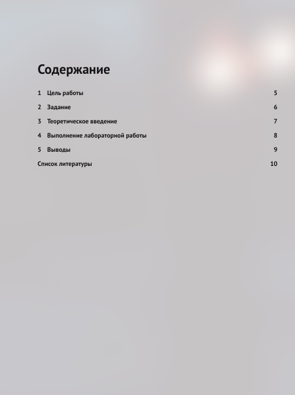

---
## Front matter
title: "Лабоаторная работа №4. Язык Markdown"
subtitle: "Дисциплина - Архитектура Компьютера"
author: "Шевырев Иван"

## Generic otions
lang: ru-RU
toc-title: "Содержание"

## Bibliography
bibliography: bib/cite.bib
csl: pandoc/csl/gost-r-7-0-5-2008-numeric.csl

## Pdf output format
toc: true # Table of contents
toc-depth: 2
lof: true # List of figures
lot: true # List of tables
fontsize: 12pt
linestretch: 1.5
papersize: a4
documentclass: scrreprt
## I18n polyglossia
polyglossia-lang:
  name: russian
  options:
	- spelling=modern
	- babelshorthands=true
polyglossia-otherlangs:
  name: english
## I18n babel
babel-lang: russian
babel-otherlangs: english
## Fonts
mainfont: PT Serif
romanfont: PT Serif
sansfont: PT Sans
monofont: PT Mono
mainfontoptions: Ligatures=TeX
romanfontoptions: Ligatures=TeX
sansfontoptions: Ligatures=TeX,Scale=MatchLowercase
monofontoptions: Scale=MatchLowercase,Scale=0.9
## Biblatex
biblatex: true
biblio-style: "gost-numeric"
biblatexoptions:
  - parentracker=true
  - backend=biber
  - hyperref=auto
  - language=auto
  - autolang=other*
  - citestyle=gost-numeric
## Pandoc-crossref LaTeX customization
figureTitle: "Рис."
tableTitle: "Таблица"
listingTitle: "Листинг"
lofTitle: "Список иллюстраций"
lotTitle: "Список таблиц"
lolTitle: "Листинги"
## Misc options
indent: true
header-includes:
  - \usepackage{indentfirst}
  - \usepackage{float} # keep figures where there are in the text
  - \floatplacement{figure}{H} # keep figures where there are in the text
---

# Цель работы

 Освоение процедуры оформления отчетов с помощью
легковесного языка разметки Markdown.

# Выполнение лабораторной работы

## Откроем терминал

{#fig:001 width=70%}

##  Перейдем в каталог созданный во время выполнения 3й лабораторной

{#fig:002 width=70%}

## Обновим локальной репозиторий с помощью `git pull`

{#fig:003 width=70%}

## Перейдем в каталог с 4 лабораторной 

{#fig:004 width=70%}

## исполним комманду make

Запустим `make` чтобы выполнить комманды из Makefile

{#fig:005 width=70%}

## Проверим новые файлы

Откроем report.md и report.pdf

{#fig:006 width=70%}

{#fig:007 width=70%}

{#fig:008 width=70%}

## Удалим полученные с использованием Makefile файлы

Исполним комманду `make clean`

{#fig:009 width=70%}

Убедимся, что файлы удалены с помощью `ls`

{#fig:010 width=70%}

## Откроем `report.md` с помощью текстового редактора

{#fig:011 width=70%}

Мы видим вспомогательную информацию в начале фала и основную часть документа: заголовки, вставка изображений с подписями и пример таблицы.

## Заполним отчет 4ой лабораторной 

Сделаем 4ю лабораторную и составим ее отчет в markdown

{#fig:012 width=70%}

## Загрузим Файлы на GitHub

Исполним комманды git add, git commit и git push

{#fig:013 width=70%}

# Задания для самостоятельной работы
## Сделать отчет по 3й лабораторной работе
### Оформим содержимое 3й лабораторной в формате Markdown

{#fig:014 width=70%}

## Скомпилируем отчет по 3 лабораторной

Исполним комманду make и проверим, создались ли файлы с помощью ls

{#fig:015 width=70%}

Просмотрим созданный report.pdf

{#fig:016 width=70%}

Сконвертируем в `pdf` и `docx` коммандой make

## Загрузим отчет на GitHub

Исполним комманы git add, git commit, git push

# Выводы

В ходе данной лабораторной работы, мы  освоили процедуры оформления отчетов с помощью

Легковесного языка разметки Markdown, сделали лабораторную работу №4 и отчет к ней в markdown и оформили саму 3ю лабораторную в markdown. А также  научились пользовать коммандой make и конвертировать отчеты в другие форматы

