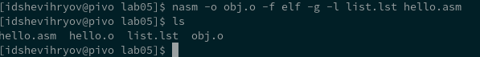

---
## Front matter
title: "Лабораторная работа №5 Создание и процесс обработки программ на языке ассемблера NASM"
subtitle: "Дисциплина: Архитектура ЭВМ"
author: "Шевырев Иван"

## Generic otions
lang: ru-RU
toc-title: "Содержание"

## Bibliography
bibliography: bib/cite.bib
csl: pandoc/csl/gost-r-7-0-5-2008-numeric.csl

## Pdf output format
toc: true # Table of contents
toc-depth: 2
lof: true # List of figures
lot: true # List of tables
fontsize: 12pt
linestretch: 1.5
papersize: a4
documentclass: scrreprt
## I18n polyglossia
polyglossia-lang:
  name: russian
  options:
	- spelling=modern
	- babelshorthands=true
polyglossia-otherlangs:
  name: english
## I18n babel
babel-lang: russian
babel-otherlangs: english
## Fonts
mainfont: PT Serif
romanfont: PT Serif
sansfont: PT Sans
monofont: PT Mono
mainfontoptions: Ligatures=TeX
romanfontoptions: Ligatures=TeX
sansfontoptions: Ligatures=TeX,Scale=MatchLowercase
monofontoptions: Scale=MatchLowercase,Scale=0.9
## Biblatex
biblatex: true
biblio-style: "gost-numeric"
biblatexoptions:
  - parentracker=true
  - backend=biber
  - hyperref=auto
  - language=auto
  - autolang=other*
  - citestyle=gost-numeric
## Pandoc-crossref LaTeX customization
figureTitle: "Рис."
tableTitle: "Таблица"
listingTitle: "Листинг"
lofTitle: "Список иллюстраций"
lotTitle: "Список таблиц"
lolTitle: "Листинги"
## Misc options
indent: true
header-includes:
  - \usepackage{indentfirst}
  - \usepackage{float} # keep figures where there are in the text
  - \floatplacement{figure}{H} # keep figures where there are in the text
---

# Цель работы
	
	Освоить процедуры компиляции и сборки программ, написанных на ассемблере NASM.
	
# Выполнение лабораторной работы

## Программа "Hello world!"

### Создадим файл `hello.asm`

#### Создадим каталок lab05

{ #fig:001 width=70% }

#### Создадим текстовый файл lab05.asm 

{ #fig:002 width=70% }

#### Откроем файл через Gedit

{ #fig:003 width=70% }

#### Введем код в файл

{ #fig:004 width=70% }

### Воспользуемся транслятором NASM

Скомпилируем вышенаписанную программу с помощью комманды `nasm -f elf hello.asm`

{ #fig:005 width=70% }

Создадим файл с другим именем ипользуя  `-o` и создадим листинг, с помощью `-l`

{ #fig:006 width=70% }

### Воспользуемся компоновщиком LD 

Выполним комманду `ld -m elf_i386 hello.o -o hello` 

{ #fig:007 width=70% }

С помощью комманды ls, увидим что файл hello создался

### Скомпонуем в  файл с именем  `main`  с помощью ключа `-o`

{ #fig:008 width=70% }

### Запустим исполняемый файл

{ #fig:009 width=70% }

На экран вывелось "Hello world!"

# Задания для самостоятельной работы

###  Создадим копию файла 

Скопируем содержимое из файла `hello.asm` в `lab5.asm`

{ #fig:010 width=70% }

### Изменим содержимое файла 

С помощью редактора Gedit заменим строку с "Hello world " на свое имя и фамилию

{ #fig:011 width=70% }

### Возспользуемся транслятором Nasm

{ #fig:012 width=70% }

### Воспользуемся компоновщиком 

С помощью комманды ld создадим исполняемый файл `lab5`

{ #fig:013 width=70% }

### Запустим `./lab05`

{ #fig:014 width=70% }

Видим как на экран выводятся наша имя и фамилия

## Загрузим файлы на GitHub

### Скопируем файлы в локальный репозиторий 
{ #fig:015 width=70% }

### Создадим git commit 
{ #fig:016 width=70% }

### Выгрузим файлы на гитхаб

используем комманду git push

{ #fig:017 width=70% }

# Выводы

За эту  лабораторной работы мы научились переводить программы на языке ассемблера NASM в исполняемый файл с помощью трансляции и компановки через ld.

Мы написали программу на NASM, которая ввыводит в терминал нашу фамилию и имя. 

