---
## Front matter
title: "Лабораторная работа №5. Основы работы с Midnight Commander (mc). Структура программы на языке ассемблера NASM."
subtitle: "Дисциплина: Архитектура ЭВМ"
author: "Иван Шевырев"

## Generic otions
lang: ru-RU
toc-title: "Содержание"

## Bibliography
bibliography: bib/cite.bib
csl: pandoc/csl/gost-r-7-0-5-2008-numeric.csl

## Pdf output format
toc: true # Table of contents
toc-depth: 2
lof: true # List of figures
lot: true # List of tables
fontsize: 12pt
linestretch: 1.5
papersize: a4
documentclass: scrreprt
## I18n polyglossia
polyglossia-lang:
  name: russian
  options:
	- spelling=modern
	- babelshorthands=true
polyglossia-otherlangs:
  name: english
## I18n babel
babel-lang: russian
babel-otherlangs: english
## Fonts
mainfont: PT Serif
romanfont: PT Serif
sansfont: PT Sans
monofont: PT Mono
mainfontoptions: Ligatures=TeX
romanfontoptions: Ligatures=TeX
sansfontoptions: Ligatures=TeX,Scale=MatchLowercase
monofontoptions: Scale=MatchLowercase,Scale=0.9
## Biblatex
biblatex: true
biblio-style: "gost-numeric"
biblatexoptions:
  - parentracker=true
  - backend=biber
  - hyperref=auto
  - language=auto
  - autolang=other*
  - citestyle=gost-numeric
## Pandoc-crossref LaTeX customization
figureTitle: "Рис."
tableTitle: "Таблица"
listingTitle: "Листинг"
lofTitle: "Список иллюстраций"
lotTitle: "Список таблиц"
lolTitle: "Листинги"
## Misc options
indent: true
header-includes:
  - \usepackage{indentfirst}
  - \usepackage{float} # keep figures where there are in the text
  - \floatplacement{figure}{H} # keep figures where there are in the text
---

# Цель работы

Приобретение практических навыков работы в Midnight Commander. Освоение

# Выполнение лабораторной работы

## Midnight Commander

### Откроем файловый менеджер Midnight Commander

{ #fig:001 width=70% }

### Перейдем в каталог `~/work/arch-pc/`

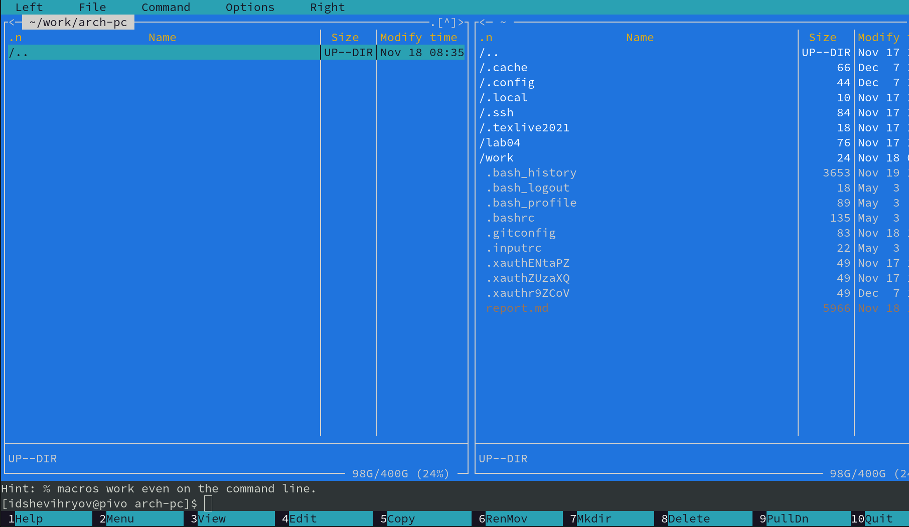{ #fig:002 width=70% }

### Создадим папку

Нажмем клавишу `F7`

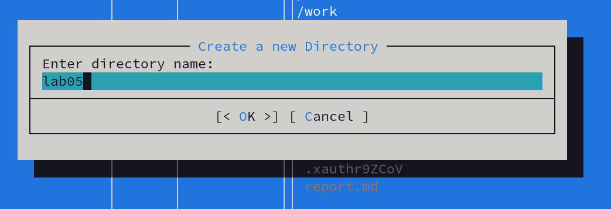{ #fig:003 width=70% }

Перейдем в созданную папку

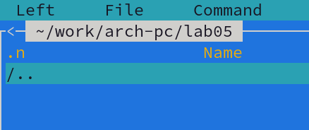{ #fig:004 width=70% }

### Создадим файл

Перейдя в папку, наберем `touch lab5-1.asm`, воспользовавшись строкой ввод. 

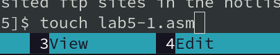{ #fig:005 width=70% }

Как видим в MC, файл создался 

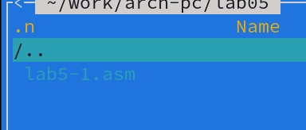{ #fig:006 width=70% }

### Откроем файл

Нажмем `F4`, что бы открыть файл

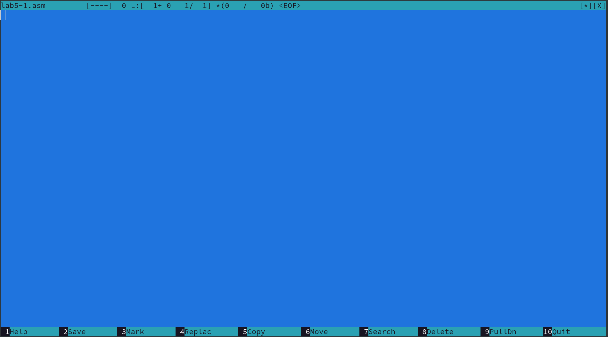{ #fig:007 width=70% }

### Введем код в файл

Введем текст программы из листинга 6.1

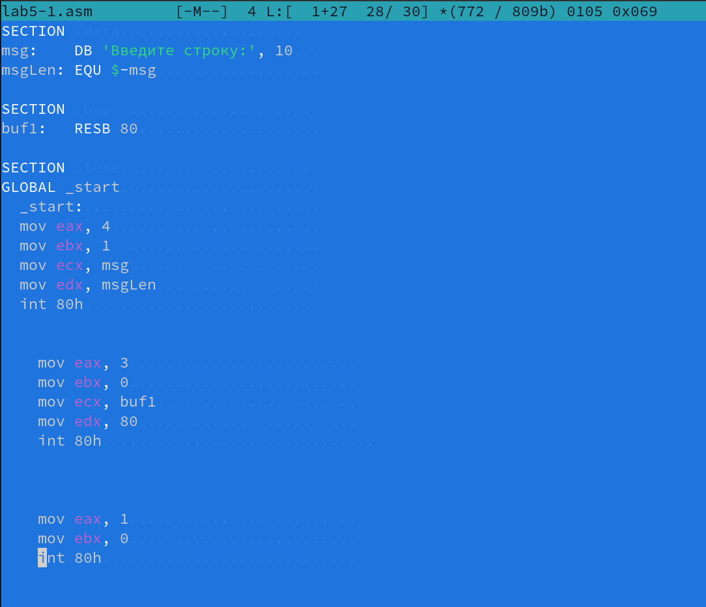{ #fig:008 width=70% }

Сохраним файл

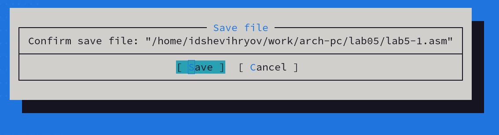{ #fig:009 width=70% }

Откроем заново файл, что б убедиться, что данные сохранились. 

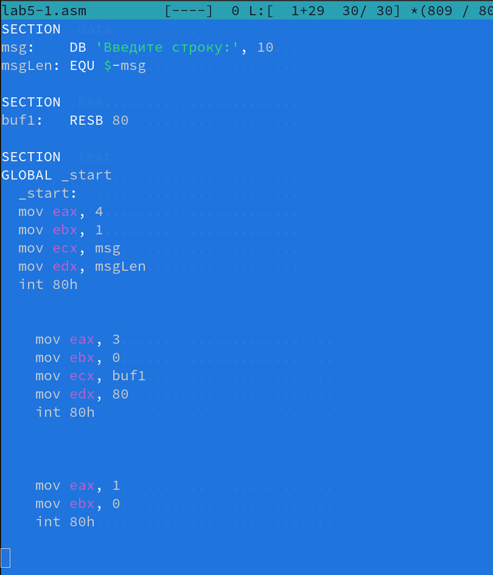{ #fig:010 width=70% }

### Запустим код

Создадим исполняемый файл и запустим его. 

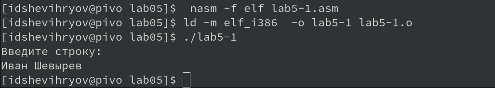{ #fig:011 width=70% }

Программа вывела наше имя.

## Подключение внешнего файла

Откроем папку с загрузками и рабочую директорию вместе, в MC

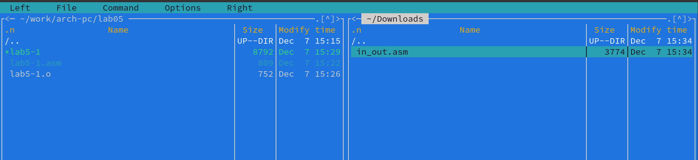{ #fig:012 width=70% }

Нажмем `F5` что бы скопировть файл. 

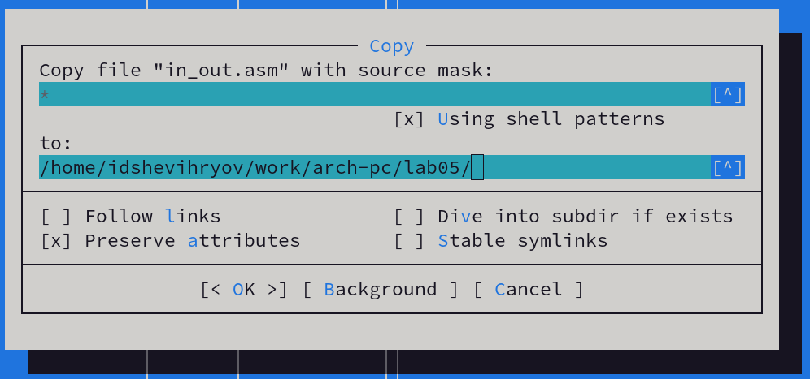{ #fig:013 width=70% }

Файлы скопировались.

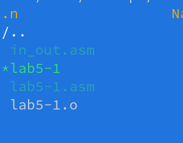{ #fig:014 width=70% }

Скопируем файл `lab5-1-asm ` в `lab5-2.asm`, нажав `F5`

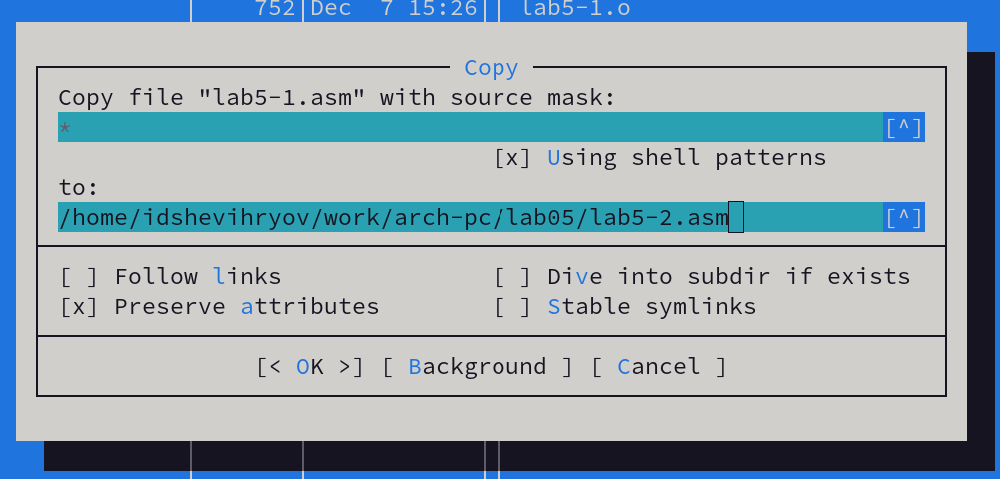{ #fig:015 width=70% }

### Написание кода для lab5-2

Введем текст в файл

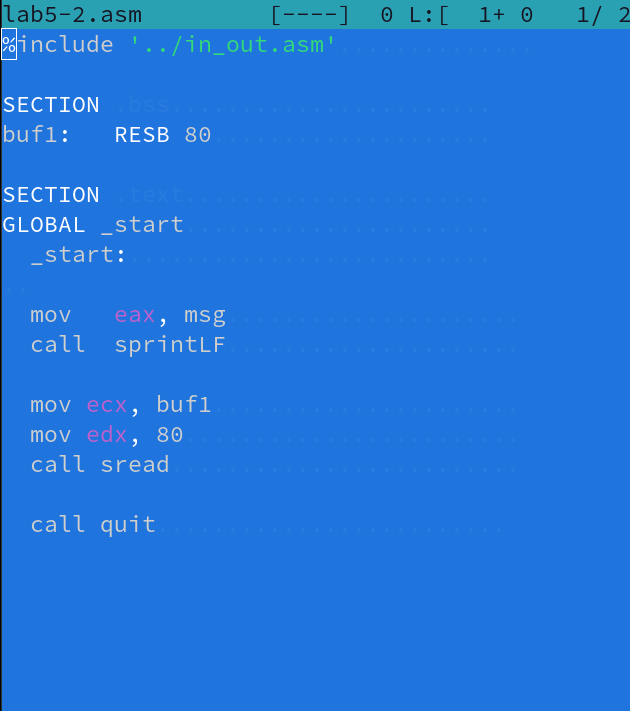{ #fig:016 width=70% }

### Исполнение кода

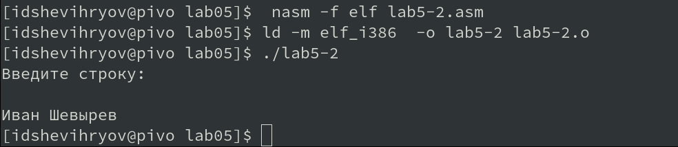{ #fig:017 width=70% }

### Изменим строчку в коде

Заменим `sprintLF` на  `sprit` и также запустим код. 

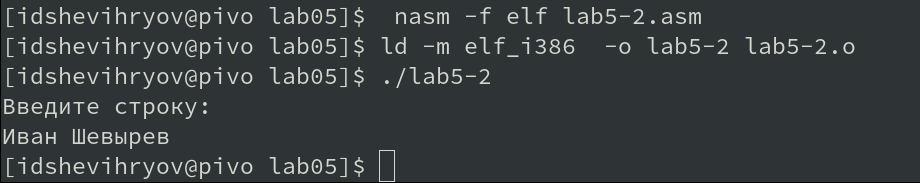{ #fig:018 width=70% }

# Задания для самостоятельной работы

## Программа без использования `in_out.asm` 

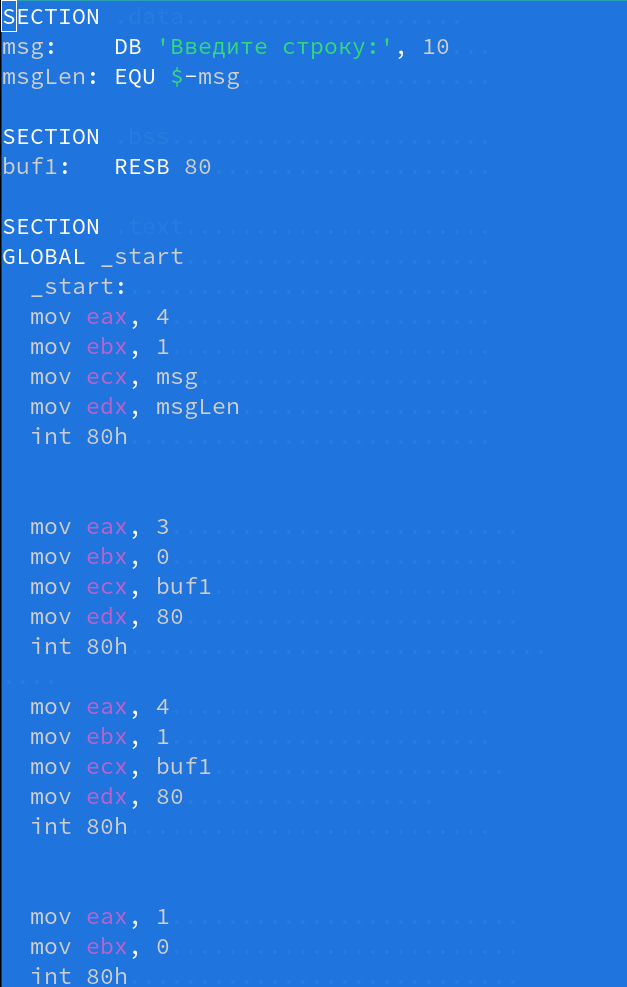{ #fig:019 width=70% }

Запустим и выведем результат

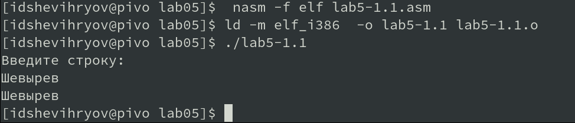{ #fig:020 width=70% }

Программа выводит введенную строку. 

## Программа с использованием `in_out.asm` 

Напишем ту же программу, используя функции из `in_out.asm`

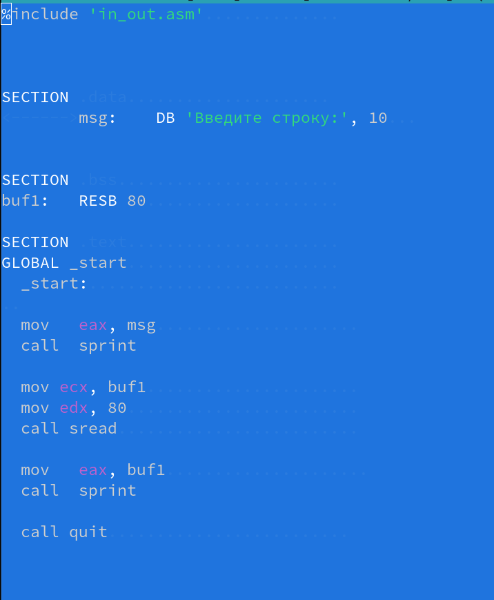{ #fig:021 width=70% }

Странслируем, слинкуем и запустим

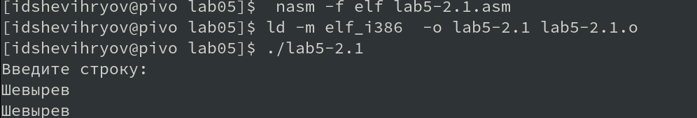{ #fig:022 width=70% }

Как видим, эта программа тоже выводит введенную строку. 

# Выводы

Мы приобрели практические навыки работы в Midnight Commander и освоили некоторые инструкции языка ассемблера (а именно mov и int ) 

