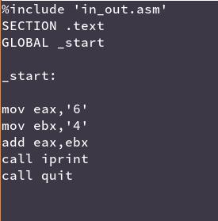
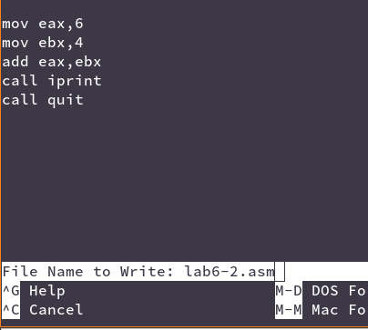

---
## Front matter
title: "Лабораторная Работа №6. Освоение арифметических инструкций языка ассемблера NASM."
subtitle: "Дисциплина: Архитектура ЭВМ"
author: "Иван Шевырев"

## Generic otions
lang: ru-RU
toc-title: "Содержание"

## Bibliography
bibliography: bib/cite.bib
csl: pandoc/csl/gost-r-7-0-5-2008-numeric.csl

## Pdf output format
toc: true # Table of contents
toc-depth: 2
lof: true # List of figures
lot: true # List of tables
fontsize: 12pt
linestretch: 1.5
papersize: a4
documentclass: scrreprt
## I18n polyglossia
polyglossia-lang:
  name: russian
  options:
	- spelling=modern
	- babelshorthands=true
polyglossia-otherlangs:
  name: english
## I18n babel
babel-lang: russian
babel-otherlangs: english
## Fonts
mainfont: PT Serif
romanfont: PT Serif
sansfont: PT Sans
monofont: PT Mono
mainfontoptions: Ligatures=TeX
romanfontoptions: Ligatures=TeX
sansfontoptions: Ligatures=TeX,Scale=MatchLowercase
monofontoptions: Scale=MatchLowercase,Scale=0.9
## Biblatex
biblatex: true
biblio-style: "gost-numeric"
biblatexoptions:
  - parentracker=true
  - backend=biber
  - hyperref=auto
  - language=auto
  - autolang=other*
  - citestyle=gost-numeric
## Pandoc-crossref LaTeX customization
figureTitle: "Рис."
tableTitle: "Таблица"
listingTitle: "Листинг"
lofTitle: "Список иллюстраций"
lotTitle: "Список таблиц"
lolTitle: "Листинги"
## Misc options
indent: true
header-includes:
  - \usepackage{indentfirst}
  - \usepackage{float} # keep figures where there are in the text
  - \floatplacement{figure}{H} # keep figures where there are in the text
---

# Цель работы


Освоение арифметических инструкций языка ассемблера NASM.

# Выполнение лабораторной работы

## Символьные и численные данные в NASM
Создадим каталог lab06 и перейдем в него, используя комманды:

```nasm
mkdir ~/work/arch-pc/lab06
cd touch lab6-1.asm
```

Создадим текстовый файл `lab6-1.asm` и введем в него листинг 7.1
{ #fig:001 width=70% }

Создадим исполняемый файл и запустим его

{ #fig:002 width=70% }

На экран вывелось j

### Изменим текстовый файл, заменив символы числами

{ #fig:003 width=70% }

Создадим исполняемый файл и запустим его.


{ #fig:004 width=70% }

Видим, что вывелся перенос строки, потому что теперь программа выводит, не символ с кодом `'6' + '4' = 106`, а с кодом `6+4 = 10`

## Программа для вывода значения eax


Введем код из листинга 7.2 

{ #fig:005 width=70% }

Запустим программу

{ #fig:006 width=70% }

### Заменим символы на числа

{ #fig:007 width=70% }

Создадим исполняемый файл и запустим

{ #fig:008 width=70% }

Вывелось 10, т.е. код переноса сторки

### Заменим `iprint` на `iprintLF`


{ #fig:009 width=70% }

Запустим программу заново

{ #fig:010 width=70% }

Вывелось 10 с переносом строки

## Выполнение арифмитических операций в NASM

Создадим и откроем файл lab6-3.asm в текстовом редакторе (nano)

{ #fig:011 width=70% }

Введем код из листинга, создадим исполняемый файл и запустим программу

{ #fig:012 width=70% }

Как видим, программа вывела $(5*2+3)/3 = 13/3 = 4.333 = 4$


Изменим программу так, что бы она вычисляла значение $(4*6 + 2)/5$

{ #fig:013 width=70% }

Странслируем, слинкуем и запустим программу: 

{ #fig:014 width=70% }

$(4*6 +2)/5 = 26/5 = 5$

## Программа вычисления варианта

Создадим файл variant.asm и введем в него текст из листинга 7.4

{ #fig:015 width=70% }

Запустим программу и введем в нее номер нашего студенческого билета. 

{ #fig:016 width=70% }

Наш номер - 2


# Задания для самостоятельной работы

Так как наш вариант: 2, нам нужно написать программу, которая будет вычислять значение функции $f(x) = (12x + 3)5$

Напишем эту программу

{ #fig:017 width=70% }

Создадим исполняемый файл и проверим данную программу на указаных значениях 

x1 = 1

x2 = 6

{ #fig:018 width=70% }

Функция вычисляется верно

$f(1) = (12+3)*5 = 75$

$f(6) = (12*6 +3)5 = 75 * 5 = 375$

# Выводы

Мы освоили арифмитические инструкции языка ассемблера NASM и  написали программу по вычислению значения функции f(x) (12x + 3)5

